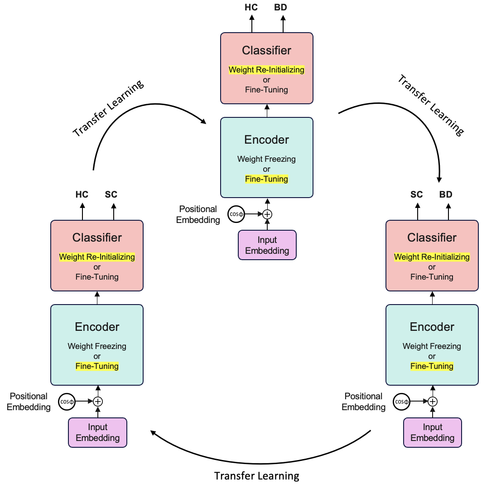

# FineFormer: Transformer-Based Differential Diagnosis of Bipolar Disorder and Schizophrenia from rs-fMRI

## Overview

This repository contains the official implementation of a deep learning framework for the **differential diagnosis of Schizophrenia (SZ) and Bipolar Disorder (BD)** using resting-state functional magnetic resonance imaging (**rs-fMRI**). The proposed method leverages **Transformer-based architectures** and a **cyclic transfer learning strategy** to address the challenges of limited sample sizes and overlapping clinical phenotypes.

The framework is designed to:

* Learn spatiotemporal representations of whole-brain rs-fMRI signals
* Exploit attention mechanisms for interpretability
* Improve generalization through sequential knowledge transfer across related diagnostic tasks

---

## Motivation

Schizophrenia and Bipolar Disorder exhibit substantial overlap in clinical manifestations, particularly during manic or psychotic episodes, which often leads to misdiagnosis and suboptimal treatment. Objective neuroimaging biomarkers are therefore essential for improving diagnostic precision.

Resting-state fMRI provides a non-invasive means of capturing intrinsic brain dynamics and functional connectivity patterns. However, its high dimensionality and limited sample availability pose significant modeling challenges. This work addresses these challenges through:

* Compact Transformer architectures
* Task-aware transfer learning
* Neuroimaging-specific data augmentation
* Rigorous cross-validation protocols

---

## Dataset Description

The experiments were conducted using a combination of two publicly available datasets:

* **UCLA Consortium for Neuropsychiatric Phenomics**
* **COBRE (Center for Biomedical Research Excellence)**

### Participants

A total of **308 subjects** were included:

* **Healthy Controls (HC):** 139
* **Schizophrenia (SZ):** 120
* **Bipolar Disorder (BD):** 49

### Input Representation

Each subject is represented as a spatiotemporal matrix of shape:

```
(T × R) = 142 × 118
```

where:

* `T = 142` time points (TRs)
* `R = 118` brain regions of interest (ROIs)

Each time step is treated as a token containing whole-brain activity information.

---

## Classification Tasks

The problem is decomposed into three binary classification tasks:

| Task | Description                          |
| ---- | ------------------------------------ |
| HS   | Healthy Control vs. Schizophrenia    |
| HB   | Healthy Control vs. Bipolar Disorder |
| BS   | Bipolar Disorder vs. Schizophrenia   |

**Label convention**:

* `0` → patient group
* `1` → control group

This convention is used consistently across all experiments and metrics.

---

## Model Architectures

Three Transformer-based architectures are investigated:

### 1. Time-Transformer

* Models temporal dependencies across the rs-fMRI time series
* Sequence length corresponds to time points
* Each token encodes whole-brain ROI activity

### 2. Region-Transformer

* Models spatial dependencies between brain regions
* Sequence length corresponds to ROIs
* Each token encodes temporal activity of a region

### 3. Hybrid-Transformer

* Sequentially combines:

  1. Temporal Transformer layers
  2. Region-based Transformer layers
* Enables joint modeling of temporal dynamics and spatial connectivity

All models employ multi-head self-attention, residual connections, layer normalization, and GELU activations.

---

## Training Strategy: Cyclic Transfer Learning

To mitigate data scarcity and improve generalization, a **sequential transfer learning strategy** is adopted.

### Procedure

1. Train the model on **HS**
2. Transfer encoder weights and retrain on **HB**
3. Transfer encoder weights and retrain on **BS**
4. Repeat the entire cycle twice

During transfer:

* The Transformer encoder is preserved
* The classification head may be reinitialized
* Fine-tuning and encoder freezing are configurable

This cyclic exposure allows the encoder to learn increasingly abstract and task-agnostic representations of rs-fMRI signals.

### Training Workflow Illustration

The following figure illustrates the cyclic transfer learning procedure used in this study:

```markdown

```

> **Note**: Place the image file at `figures/training_strategy.png`.

---

## Cross-Validation and Evaluation

* **5-fold cross-validation** with fixed subject splits
* Identical folds used across all tasks to prevent data leakage
* Early stopping based on validation performance
* Performance reported as mean over folds

### Evaluation Metrics

* Accuracy (ACC)
* Sensitivity (Sens)
* Specificity (Spec)
* Negative Predictive Value (NPV)
* Area Under the ROC Curve (AUC)
* Precision (Prec)
* F1-score (F1)

---

## Results

Table 1 summarizes the performance of all models after the second iteration of cyclic transfer learning.

### Table 1. Performance of Transformer-Based Models (Iteration 2)

| Model              | Task | ACC       | Sens      | Spec      | NPV       | AUC       | Prec      | F1        |
| ------------------ | ---- | --------- | --------- | --------- | --------- | --------- | --------- | --------- |
| Time-Transformer   | HS   | **0.884** | 0.833     | **0.928** | **0.911** | 0.860     | **0.911** | 0.870     |
| Region-Transformer | HS   | 0.780     | 0.742     | 0.814     | 0.789     | 0.737     | 0.787     | 0.756     |
| Hybrid-Transformer | HS   | **0.884** | **0.867** | 0.900     | 0.888     | **0.881** | 0.888     | **0.874** |
| Time-Transformer   | HB   | **0.900** | 0.698     | **0.971** | 0.903     | 0.784     | 0.898     | 0.773     |
| Region-Transformer | HB   | 0.857     | 0.573     | 0.957     | 0.867     | 0.756     | 0.867     | 0.663     |
| Hybrid-Transformer | HB   | 0.899     | **0.738** | 0.957     | **0.914** | **0.820** | **0.900** | **0.790** |
| Time-Transformer   | BS   | **0.923** | **1.000** | 0.739     | **1.000** | 0.850     | 0.904     | **0.950** |
| Region-Transformer | BS   | 0.870     | 0.983     | 0.591     | 0.949     | 0.718     | 0.858     | 0.916     |
| Hybrid-Transformer | BS   | 0.911     | 0.942     | **0.839** | 0.862     | **0.854** | **0.936** | 0.938     |

**Key observations**:

* The **Hybrid-Transformer** demonstrates the most balanced and stable performance across tasks.
* In the challenging **BS task**, both Time and Hybrid models exceed **90% accuracy**.
* The Time-Transformer achieves **perfect sensitivity (1.00)** in distinguishing SZ from BD.

---

## Interpretability

The framework supports **attention weight extraction** at the subject level:

* Attention maps can be analyzed across time or regions
* Enables identification of salient temporal segments or brain regions
* Facilitates neurobiological interpretation of model decisions

---

## Reproducibility

The repository includes:

* Fixed fold indices
* Saved model checkpoints
* Training histories
* Per-fold and aggregated metrics
* Attention weight files

All experiments are fully reproducible given the same preprocessing pipeline and fold definitions.

---

## Citation

If you use this code, please cite the associated paper:

```bibtex
@article{YourPaper2025,
  title={FineFormer: Transformer-Based Differential Diagnosis of Bipolar Disorder and Schizophrenia from rs-fMRI},
  author={...},
  journal={...},
  year={2025}
}
```
