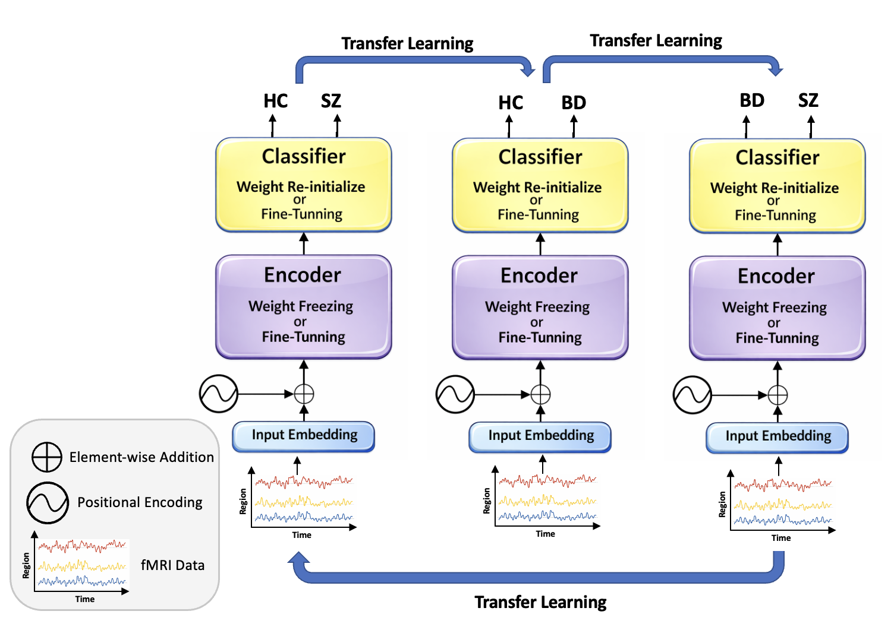

---

# 🧠 **FineFormer**

## *Transformer-Based Differential Diagnosis of Bipolar Disorder and Schizophrenia from rs-fMRI*

---

## 📌 Overview

This repository provides the official implementation of **FineFormer**, a Transformer-based deep learning framework for the **differential diagnosis of Schizophrenia (SZ) and Bipolar Disorder (BD)** using **resting-state functional magnetic resonance imaging (rs-fMRI)**.

The proposed approach integrates:

* **Attention-based Transformer architectures**
* A **cyclic sequential transfer learning strategy**

### 🎯 Motivation

Schizophrenia and Bipolar Disorder frequently present overlapping symptoms—particularly during manic or psychotic episodes—making accurate differential diagnosis based solely on clinical assessments highly challenging. While rs-fMRI provides a non-invasive window into intrinsic brain dynamics, its application is hindered by high dimensionality, temporal complexity, and severe data scarcity.

This work addresses these challenges through compact, task-aware Transformer architectures and a cyclic knowledge-transfer protocol that prevents local minima and maximizes representation learning across limited neuroimaging datasets.

---

## 📊 Dataset & Input Representation

Experiments were conducted using two publicly available neuroimaging datasets: **UCLA Consortium for Neuropsychiatric Phenomics (CNP)** and **COBRE**.

| Group | Count |
| --- | --- |
| Healthy Controls (HC) | 139 |
| Schizophrenia (SZ) | 120 |
| Bipolar Disorder (BD) | 49 |

Each subject is represented by a **spatiotemporal matrix** of size `(T × R) = 142 × 118`, where `T = 142` time points (TRs) and `R = 118` brain regions of interest (ROIs). Each time point is treated as a token encoding whole-brain activity, enabling attention-based modeling of long-range dependencies without global standardizations that risk data leakage.

---

## 🏗️ Model Architectures

Three Transformer-based architectures are investigated:

1. **Temporal Transformer:** Models dynamic sequence evolution across the rs-fMRI time series.
2. **Spatial (Region) Transformer:** Models static, distributed inter-regional connectivity.
3. **Hybrid-Transformer:** Sequentially combines Temporal and Spatial layers to jointly model spatiotemporal interplay.

<p align="center">
  
</p>

---

## 🔁 Cyclic Transfer Learning Strategy

The diagnostic problem is decomposed into three binary classification tasks (`0` = Patient, `1` = Control/Comparison):

* **HS:** Healthy Control vs. Schizophrenia
* **HB:** Healthy Control vs. Bipolar Disorder
* **BS:** Bipolar Disorder vs. Schizophrenia

To mitigate data scarcity, the model utilizes a **cyclic sequential transfer learning strategy**. Shared encoder weights are sequentially transferred across the tasks (HS → HB → BS), while the task-specific classification head is reinitialized. The entire cycle is repeated twice to enforce generalized, task-agnostic rs-fMRI representation learning.

<p align="center">
  
</p>

---

## ⚙️ Repository Structure & Setup

The codebase is highly modularized, strictly isolating architecture logic from execution orchestration using Hydra configuration management.

```text
paper_code/
├── configs/          # Hydra YAML configs (model, cycle, task parameters)
├── Data/             # Target directory for local fMRI datasets
├── figures/          
├── results/          # Auto-generated checkpoints, attention weights, and metrics
├── scripts/          # Execution scripts (parity checks, visualizers)
├── src/              # Core modules (data, models, cyclic training loops)
└── main.py           # Unified CLI entry point

```

### Installation

```bash
git clone https://github.com/ramintavakolii/FineFormer.git
cd FineFormer

python3 -m venv venv
source venv/bin/activate
pip install --upgrade pip
pip install -r requirements.txt

```

### Data Configuration

By default, the pipeline expects data in `./Data`. Point the environment variable to your dataset before training:

```bash
export FMRI_DATA_PATH="$(pwd)/Data"

```

---

## 🚀 Training Pipeline

### 1. Verification

Before full training, run the parity check to ensure the modular pipeline perfectly matches the paper's mathematical definitions and tensor shapes:

```bash
python scripts/parity_check.py

```

### 2. Cyclic Execution

Execute the tasks in strict order. The `cyclic_manager.py` handles encoder transfer and classifier reinitialization automatically.

**Cycle 1:**

```bash
python main.py --model hybrid --task HS --cycle 1
python main.py --model hybrid --task HB --cycle 1
python main.py --model hybrid --task BS --cycle 1

```

**Cycle 2:**

```bash
python main.py --model hybrid --task HS --cycle 2
python main.py --model hybrid --task HB --cycle 2
python main.py --model hybrid --task BS --cycle 2

```

*(Swap `--model hybrid` for `--model time` or `--model region` to evaluate other architectures).*

### 3. Hyperparameter Overrides & Grid Search

Override specific YAML parameters via the CLI, or trigger an automated grid search based on the predefined ranges in `configs/cycle/`:

```bash
python main.py --model hybrid --task HS --cycle 1 --lr 2e-4 --dropout 0.15
python main.py --model hybrid --task HS --cycle 1 --hyperparam-search

```

### 4. Visualization & Interpretability

FineFormer supports attention weight extraction for neurobiological interpretation. To visualize training curves and bar charts after a run:

```bash
python scripts/visualize_results.py \
  --result-path ./results/hybrid/cycle_1/hs \
  --summary-name cv_summary_healthy_vs_schizo.pt \
  --save

```

---

## 📚 Citation

If you use this code or framework in your research, please cite the associated paper:

```bibtex
@article{FineFormer2025,
  title   = {FineFormer: Transformer-Based Differential Diagnosis of Bipolar Disorder and Schizophrenia from rs-fMRI},
  author  = {...},
  journal = {...},
  year    = {2025}
}

```